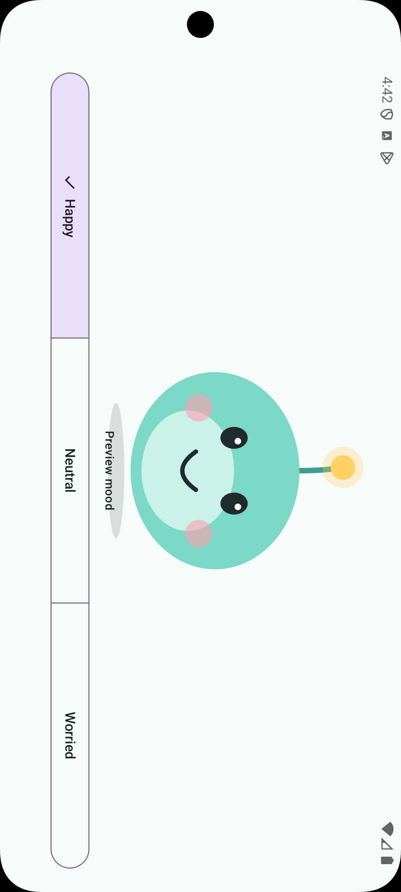

# Nudgi

A little companion that helps you cut down on doom-scrolling, remember to go to sleep, and more. Nudgi lives on your
phone, watches how you use it, and nudges you gently, with a friendly face that reflects how things are going.

> **Status:** early development. The app currently shows Nudgi and its moods; usage tracking, notifications and app
> blocking are on the [roadmap](#roadmap).



## Principles

- **On-device only.** No backend, no cloud AI, no telemetry. See [PRIVACY.md](PRIVACY.md).
- **Rules first, learning later.** The first version is rule-based and doubles as the data-collection phase for a small
  on-device model (a contextual bandit) that comes afterwards.
- **Sideloaded.** Distributed as an APK on GitHub rather than through the Play Store, because blocking apps relies on an
  accessibility service that store policies restrict.

## Roadmap

1. [x] Mascot and app skeleton
2. [ ] Usage tracking and rule-based nudges
3. [ ] Home screen widget
4. [ ] App blocking with progressive friction (gentle nudge, warning overlay, forced close as a last resort)
5. [ ] Lock screen widget (deferred: depends on platform support)
6. [ ] On-device contextual bandit
7. [ ] Watch connectivity through Health Connect

## Permissions

None are requested yet. Usage access, notifications and an accessibility service will be requested as the features that
need them land; see [PRIVACY.md](PRIVACY.md) for the reasons.

## Install

Signed APKs will be published on the [Releases](https://github.com/Viincii/Nudgi/releases) page. Until then, build it
from source.

## Build from source

Requirements: JDK 21 and the Android SDK (platform 37). Android Studio is optional.

```bash
./gradlew assembleDebug        # build the debug APK
./gradlew testDebugUnitTest    # unit tests
./gradlew lintDebug            # Android lint
./gradlew spotlessApply        # format the code
```

The debug APK lands in `app/build/outputs/apk/debug/`.

## Project layout

| Module | Role |
|---|---|
| `app` | Application entry point, Hilt setup |
| `core:designsystem` | Theme and shared UI building blocks |
| `core:mascot` | Nudgi's drawing and animations |
| `core:database` | Room database (schema coming with usage tracking) |
| `feature:home` | Home screen |
| `build-logic` | Gradle convention plugins shared by all modules |

Architecture notes and the reasoning behind key choices live in [CLAUDE.md](CLAUDE.md) and
[docs/decisions](docs/decisions).

## Built with AI assistance

Development is done with Claude Code, and the process is part of the project: small atomic commits, a `CLAUDE.md` that
carries the architectural context between sessions, and decisions written down as they are made.

## License

[MIT](LICENSE)
